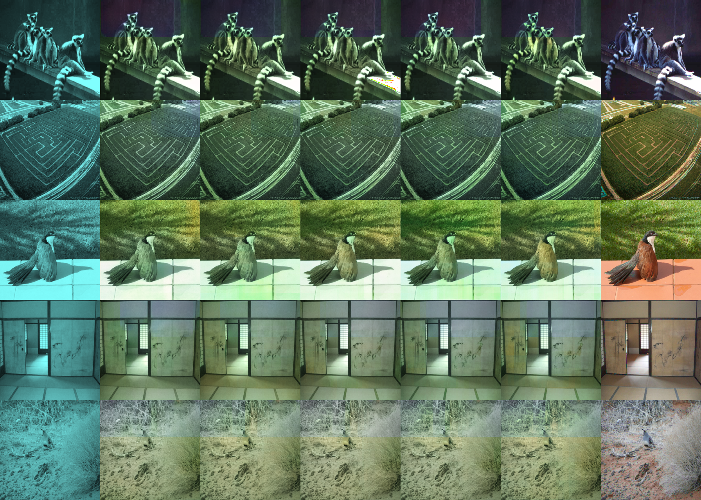
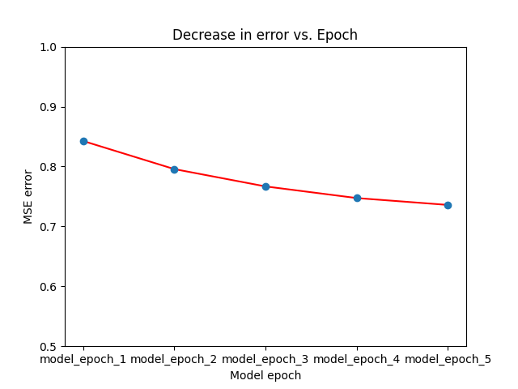
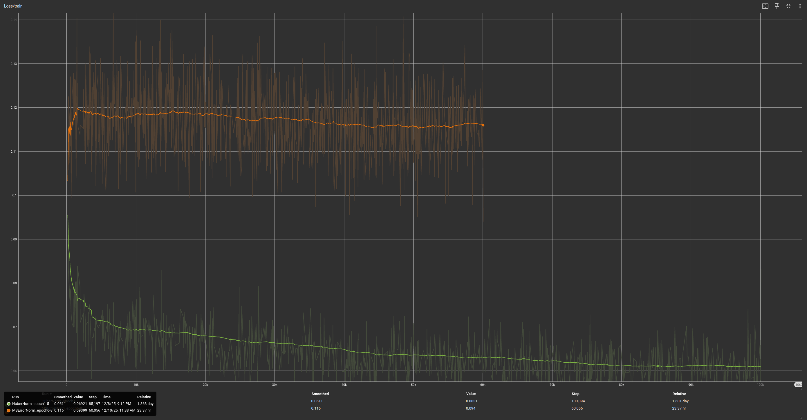
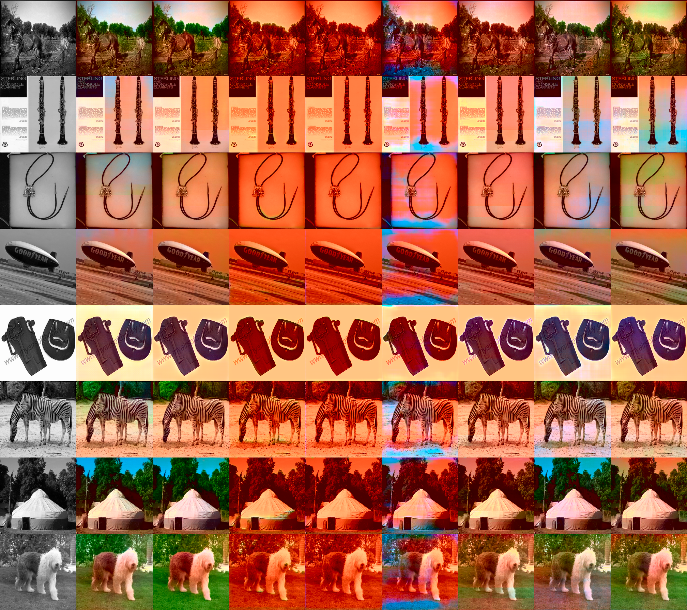
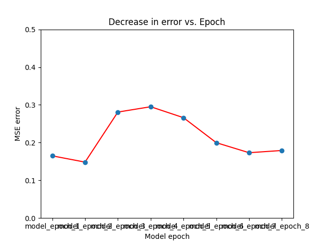

# UNet
Creating a UNet Convolutional Neural Network for interactively colourising black and white photos.

## Create Python virtual environment
```python3 - m venv .venv```

```source .venv/bin/activate```

```pip install -r requirements.txt```

## Paper
[Paper](paper/1505.04597v1.pdf)

[Uni-Freiberg: Olaf Ronneberger: 18 May 2015](https://lmb.informatik.uni-freiburg.de/people/ronneber/u-net/)

[Debugger Cafe: Sovit Ranjan Rath: 3 April 2023](https://debuggercafe.com/unet-from-scratch-using-pytorch/)

Modified to take greyscale photos as input, then output LUV colorised photos


----
# Version 1
- No BatchNorm
- Image input and targets Normalized: $\mu$: 0.5, $\sigma$ 0.25 
- Epochs: 5
- Mean Squared Error Loss
- No dropout
- Learning Rate: 5e-5

## Training
Training loss (smoothed) / Time


## Results



Input | Epoch 1 | Epoch 2 | Epoch 3 | Epoch 4 | Epoch 5 | Ground Truth 
----- | ----- | ----- | ----- | ----- | ----- | ----- | 





------

# TODO
- [x] Fix HSV normalization
- [x] Run performance evaluation
- [ ] Pytorch and Rust GUI : https://medium.com/@heyamit10/loading-and-running-a-pytorch-model-in-rust-f10d2577d570
- [ ] Dropout

-----

# Version 2 
Highly experimental trails of different error functions, normalisation methods, droput / no dropout
## Proposal
 - [x] Removed Image input and targets Normalized: $\mu$: 0.5, $\sigma$ 0.25 
 - [x] No normalisation 
 - [x] Improved Loss function: MSE + SSIM
 - [x] BatchNorm on down conv, hints down conv, up conv, and hints up conv
 - [x] Skip Connection Self Convolution on level 2, 3, 4, 5
 - [X] Hintegration: Convolve hints, then integrate then convolve colour hints alongside down convolutions.
 - [ ] Dropout (not from school, from network)
 - [ ] Variable learning rate
 - [ ] Variable hints per epoch
 - [x] 51,086,771 total trainable parameters.

 ## Epoch 1
 Num points = 150
 
 -----

 # Version 3
 ## Proposal
 61,508,906 total parameters.
 - [x] Convert to LAB colorspace
 - [x] 2 Channel output
 - [ ] K-means global hints
 - [ ] Sobel-MSE(O,Y),
 - [x] Hubert(O,Y) loss functions: https://docs.pytorch.org/docs/stable/generated/torch.nn.HuberLoss.html
 - [x] Dropout
 - [x] Remove MaxPooling, downsample instead
 - [x] Reimplement Hints skip connections

 ## Training 
 

 This image shows the first five training epochs in Green, where the Huber loss function was used. The next three training epochs are in Orange, where the MSError loss function was used. Each epoch was ~20k image batches. The lowest loss values do not necessarily reflect better visual results. Epochs 3-5 achieeved the better loss results recorded, but the visual accuracy of the images was degraded. Training with Huber loss allowed the model to train on  higly variable data without incurring huge losses, but allowed later epochs to overtrain and lose accuracy. Switching to MSError after epoch 5 allowed the model to produce more accurate results.

 ## Notes
 This model improved upon the last version by fully implementing a hint convolutional feed-forward network. This model passes colour hints up the U-Net structure to higher complexity convolutional layers, allowing hint information to permeate the network at the highest levels. This version also removed the max-pooling layers, instead making down-convolutions that reduce channel size. The LAB colour-space was implemented in this version which is easier to train on than HSV colour-space. The first 5 epochs were trained with a Huber loss function, the last 3 epochs were trained on MSError loss functions. This allowed the network to train easily on high-variance data, later MSError was used to train the network back to expected results after epoch 5. 

 ## Results


## Evaluation
