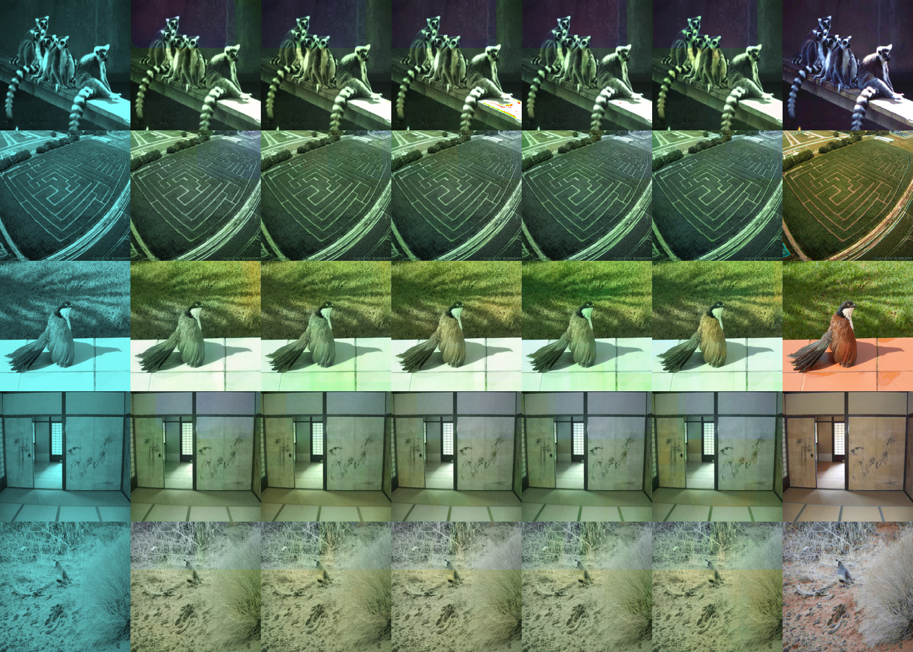

# UNet
Creating a UNet Convolutional Neural Network for interactively colourising black and white photos.

## Create Python virtual environment
```python3 - m venv .venv```

```source .venv/bin/activate```

```pip install -r requirements.txt```

## Paper
[Paper](paper/1505.04597v1.pdf)

[Uni-Freiberg: Olaf Ronneberger: 18 May 2015](https://lmb.informatik.uni-freiburg.de/people/ronneber/u-net/)

[Debugger Cafe: Sovit Ranjan Rath: 3 April 2023](https://debuggercafe.com/unet-from-scratch-using-pytorch/)

Modified to take greyscale photos as input, then output LUV colorised photos

# Version 1
- No BatchNorm
- Image input and targets Normalized: $\mu$: 0.5, $\sigma$ 0.25 
- Epochs: 5

## Training
Training loss (smoothed) / Time


## Results

Input, Epoch 1, Epoch 2, Epoch 3, Epoch 4, Epoch 5, Ground Truth

## TODO
- [ ] Fix HSV normalization
- [ ] Run performance evaluation
- [ ] Pytorch and Rust GUI : https://medium.com/@heyamit10/loading-and-running-a-pytorch-model-in-rust-f10d2577d570